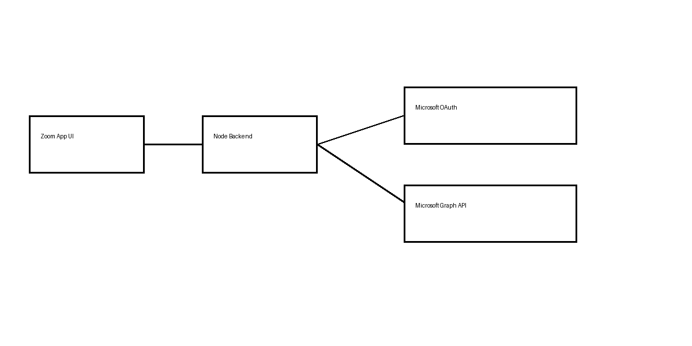

# 🚀 Zoom X Microsoft Integration

## 🌐 Architecture Diagram

---

## 🔐 Authentication Flow

Zoom App → Backend → Microsoft OAuth → Access Token → Microsoft Graph → Zoom UI

---

# 🧩 Configuration & Setup Details

## 1️⃣ Zoom Marketplace Configuration

- App Type: **Zoom App (User-managed)**
- Enabled Features:
  - ✅ In-Client OAuth
- Home URL:
  - https://your-ngrok-url
- Domain Allow List:
  - your-ngrok-domain (without https)
- OAuth Redirect URL:
  - https://your-ngrok-url/auth/zoom/callback
- Surfaces Enabled:
  - ✅ Meetings
- SDK Used:
  - `zoomSdk.openUrl()` for external auth flow

---

## 2️⃣ Azure (Microsoft Entra ID) Configuration

### App Registration
- Created App: *Coda Outlook / Word Integration*
- Supported Accounts:
  - Any Microsoft account (multi-tenant)

### Redirect URI
- https://your-ngrok-url/auth/outlook/callback

### API Permissions

#### Common
- openid
- profile
- email
- offline_access

#### Outlook
- Mail.Read

#### Word / OneDrive
- Files.Read

👉 Important:
- Click **Grant Admin Consent**

---

## 3️⃣ Backend Configuration (Node.js)

### Tech
- Express.js
- MSAL (Microsoft Authentication Library)

### Key Features
- OAuth Authorization Code Flow
- Token exchange & storage
- In-memory token store (Map)
- Microsoft Graph API calls

### Endpoints

#### Auth
- `/auth/outlook/start`
- `/auth/outlook/callback`
- `/auth/outlook/status`

#### Outlook
- `/emails/latest`

#### Word
- `/word/docs`
- `/word/latest-metadata`

### Security
- Tokens stored on backend only
- No exposure to frontend
- Uses `linkId` for session mapping

---

## 4️⃣ Zoom Workplace (Client Side)

### How connection works

1. User opens Zoom App
2. Clicks **Connect MS Account**
3. Zoom SDK opens external browser
4. User logs into Microsoft
5. Backend receives token
6. Zoom UI polls connection status
7. Data becomes available in UI

### Important Behavior

- Zoom app runs in **webview**
- External login happens in browser
- Session handled using `linkId` (not cookies)

---

# 📧 Outlook Integration

## Features
- Fetch last 3 emails
- Show:
  - Subject
  - Sender
  - Timestamp
  - Preview

---

# 📄 Word Integration

## Features
- Fetch last 3 Word documents
- Show metadata of latest document

## Metadata Includes
- File name
- Size
- Created date
- Last modified date
- File path
- MIME type

---

# ⚠️ Limitations

## ❌ Cannot open Word inside Zoom
- Microsoft blocks embedding in webviews

## ❌ No persistence
- Tokens stored in-memory
- Restart server → reconnect required

---

# 🧠 Key Concepts

### Backend-mediated token sharing

Zoom → Backend → Microsoft Graph

---

# 🧪 Demo Walkthrough

1. Start backend:
   node server.js

2. Start ngrok:
   ngrok http 3000

3. Open Zoom App

4. Click **Connect MS Account**

5. Login via Microsoft

6. Click:
   - Show Emails
   - Show Word Documents

---

# 🚀 Future Improvements

- Persistent storage (DB)
- Nested folder support
- Document preview parsing
- File upload/create
- Deployment (no ngrok)

---

# 🏁 Summary

This project demonstrates:
- Zoom + Microsoft OAuth integration
- Secure backend token handling
- Microsoft Graph API usage
- Cross-platform integration

---

